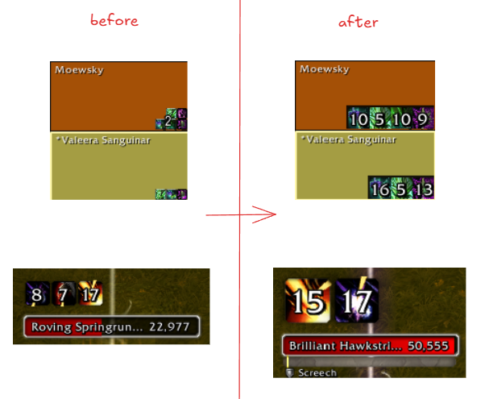
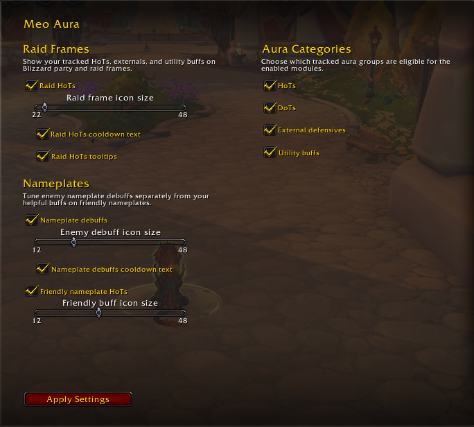

# MeoRaidHots (or your addon name)

## What it does
Enhances visibility of important HoTs on raid frames and nameplates.

## Features
- Enlarged HoT icons
- Better visibility in raid frames
- Nameplate support

## Installation
Download and place in:
World of Warcraft/_retail_/Interface/AddOns/

## Screenshot

## Notes
Arena module removed for now (may come later)